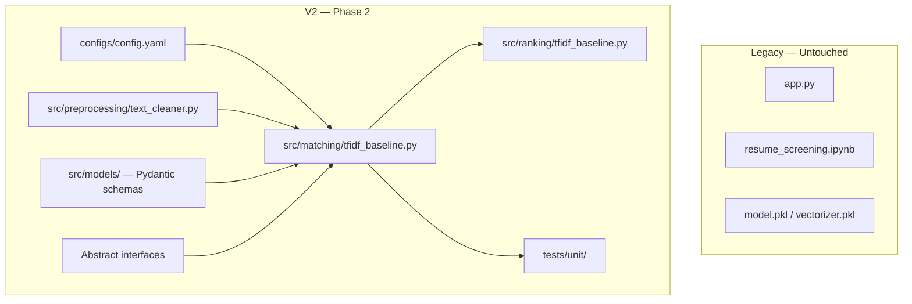

# AI Resume Intelligence & Explainable Candidate Ranking System (V2)

**Version:** 2.0.0 (Phase 6 — Entity Intelligence & Skill Gap)

V2 is a modular rebuild of the legacy resume screening prototype. The original system (`app.py`, notebook, pickle artifacts) remains **untouched** for reference.

---

## Problem Statement

Recruiters need to match candidates to job descriptions with **transparent, explainable scores** — not a single opaque percentage. V2 transforms a monolithic TF-IDF Streamlit prototype into a production-style AI/NLP pipeline with clear separation of concerns.

---

## V2 Architecture (Current Phase)



### Layer Responsibilities

| Layer | Status | Purpose |
|-------|--------|---------|
| `src/ingestion/` | **Implemented** | PDF/DOCX/TXT ingestion via factory |
| `src/parsing/` | **Implemented** | Resume + JD parsers |
| `src/preprocessing/` | **Implemented** | Configurable text cleaning |
| `src/extraction/` | Stub | Skill/entity extraction (Phase 6) |
| `src/embeddings/` | Interface only | Sentence embeddings (Phase 7) |
| `src/matching/` | **Baseline implemented** | TF-IDF + cosine similarity |
| `src/scoring/` | Interface only | Hybrid multi-signal scoring (Phase 8) |
| `src/ranking/` | **Baseline implemented** | Candidate ranking by TF-IDF score |
| `src/explainability/` | Interface only | Feature-based explanations (Phase 10) |
| `src/llm/` | Interface only | Optional LLM summaries (Phase 13) |
| `src/storage/` | Interface only | SQLite persistence (Phase 16) |
| `api/` | Stub | FastAPI backend (Phase 14) |
| `app/` | Stub | Streamlit frontend (Phase 15) |

---

## Supported Document Formats (Phase 3)

V2 ingests resumes and job descriptions through a unified `Document` abstraction:

| Format | Extension | Library | Notes |
|--------|-----------|---------|-------|
| PDF | `.pdf` | `pypdf` | Per-page extraction, encrypted PDF detection |
| Word | `.docx` | `python-docx` | Paragraphs and table text |
| Plain text | `.txt` | stdlib | UTF-8 with latin-1/cp1252 fallback |

```python
from src.ingestion import ingest_document

with open("resume.pdf", "rb") as f:
    document = ingest_document(f.read(), filename="resume.pdf")

print(document.extracted_text)
print(document.page_count)  # PDF pages; 1 for DOCX/TXT
```

Validation (extension, size, magic bytes, empty content) is driven by `configs/config.yaml`.

---

## Resume Parsing (Phase 4)

Structured parsing converts any ingested `Document` into a `ParsedResume`:

```python
from src.parsing import ingest_and_parse_resume

parsed = ingest_and_parse_resume(file_bytes, filename="resume.pdf")
print(parsed.name, parsed.skills, parsed.experience)
print(parsed.parsing_quality)  # high | medium | low
```

Detected sections: Summary, Experience, Skills, Education, Projects, Certifications, Achievements, Publications, Languages.

The parser is **format-agnostic** — it consumes `Document`, not raw files.

---

## Job Description Parsing (Phase 5)

Structured JD parsing produces `ParsedJobDescription` with required/preferred skills, evidence, and experience requirements:

```python
from src.parsing import parse_job_description

jd = parse_job_description(jd_text)
print(jd.title, jd.all_required_skill_names)
print(jd.required_skills[0].evidence)  # source sentence preserved
```

See [docs/job_parsing.md](docs/job_parsing.md) for full documentation.

---

## Entity Intelligence & Skill Gap (Phase 6)

Resume and JD share one skill vocabulary. Deterministic gap analysis:

```python
from src.matching import compute_skill_gap
from src.parsing import ingest_and_parse_resume, parse_job_description

resume = ingest_and_parse_resume(file_bytes, "resume.pdf")
job = parse_job_description(jd_text)
gap = compute_skill_gap(resume, job)

print(gap.required_skill_coverage)  # skill coverage % — not final match score
print(gap.missing_required)
```

See [docs/entity_intelligence.md](docs/entity_intelligence.md).

---

## Baseline Matching (TF-IDF)

The V2 baseline reimplements the legacy notebook approach as a clean, testable module:

1. Clean resume and JD text via `clean_text()`
2. Vectorize JD + resumes together with `TfidfVectorizer` (shared vocabulary per batch)
3. Compute cosine similarity
4. Return structured `MatchResult` with component scores

**Configuration** (`configs/config.yaml`):

```yaml
matching:
  baseline:
    vectorizer:
      max_features: 2000
      sublinear_tf: true
      stop_words: "english"
```

This mirrors the legacy notebook parameters for fair comparison in later evaluation phases.

---

## Project Structure

```
v2/
├── app/                    # Streamlit UI (Phase 15)
├── api/                    # FastAPI backend (Phase 14)
├── src/
│   ├── ingestion/          # PDF/DOCX/TXT ingestion (implemented)
│   ├── parsing/            # Resume parser (implemented)
│   ├── preprocessing/      # Text cleaning (implemented)
│   ├── extraction/         # Entity extraction (Phase 6)
│   ├── embeddings/         # Embedding engine ABC
│   ├── matching/           # TF-IDF baseline (implemented)
│   ├── scoring/            # Hybrid scorer ABC
│   ├── ranking/            # TF-IDF ranker (implemented)
│   ├── explainability/     # Explainer ABC
│   ├── recommendations/    # Job recommendations (Phase 12)
│   ├── llm/                # LLM service ABC
│   ├── storage/            # Persistence ABC
│   ├── models/             # Pydantic domain models
│   └── utils/              # Config, logging
├── configs/config.yaml
├── tests/unit/
├── docs/audit_report.md
├── requirements.txt
└── pyproject.toml
```

---

## Installation

```bash
cd v2
python -m venv .venv
.venv\Scripts\activate        # Windows
pip install -r requirements.txt
```

---

## Running Tests

```bash
cd v2
pytest
```

---

## Configuration

All settings live in `configs/config.yaml`. Environment variable overrides:

| Variable | Effect |
|----------|--------|
| `OPENAI_API_KEY` | Enables LLM when implemented |
| `DATABASE_URL` | Overrides SQLite path |
| `APP_ENVIRONMENT` | Sets environment label |
| `LOG_LEVEL` | Adjusts logging verbosity |

---

## Legacy System Limitations (Summary)

See [docs/audit_report.md](docs/audit_report.md) for the full audit.

- Monolithic Streamlit app with global pickle loading
- PDF-only, flat-text processing
- No structured parsing, explainability, or batch ranking in UI
- TF-IDF labeled as "semantic similarity" — it is bag-of-words matching
- No tests, API, configuration, or evaluation framework
- Duplicate rows in training data inflate classification accuracy

---

## Next Phases

| Phase | Deliverable |
|-------|---------------|
| **3** | ~~Document ingestion (PDF, DOCX, TXT)~~ **Done** |
| **4** | ~~Resume section parser~~ **Done** |
| **5** | ~~Job description parser~~ **Done** |
| **6** | Skill/entity extraction + normalization (shared vocabulary started) |
| **7** | Sentence Transformer embeddings |
| **8** | Hybrid scoring engine |

---

## License

Educational and portfolio use.
