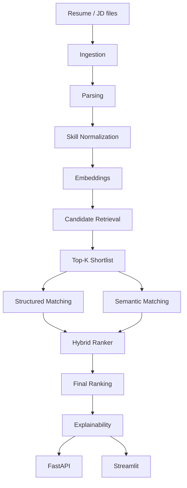

# AI Resume Screening & Explainable AI

## Overview

A modular resume screening pipeline that ingests PDF/DOCX/TXT documents, parses resumes and job descriptions, retrieves candidate shortlists via embeddings, ranks candidates with a hybrid scorer, and produces evidence-grounded explanations. Includes a FastAPI backend and Streamlit demo UI.

## Problem Statement

Keyword-only and TF-IDF approaches miss semantic equivalence, cannot distinguish required vs preferred skills, and produce opaque scores with no explanation of ranking decisions.

## Solution

A layered pipeline separates **retrieval** (who might be relevant) from **ranking** (how well they match) and adds a presentation-only explainability layer:

| Layer | Responsibility |
|-------|----------------|
| Document Ingestion | PDF, DOCX, TXT → structured text |
| Resume & JD Parsing | Sections, skills, experience, education |
| Skill Normalization | Canonical skill mapping (e.g. sk-learn → scikit-learn) |
| Semantic Embeddings | sentence-transformers (all-MiniLM-L6-v2) |
| Candidate Retrieval | In-memory vector top-K shortlist |
| Hybrid Ranking | TF-IDF + semantic + structured skill matching |
| Explainability | Deterministic evidence narrative (optional LLM abstraction) |
| FastAPI / Streamlit | Programmatic and interactive screening |

## Architecture



## Core Features

- Document ingestion (PDF, DOCX, TXT)
- Resume and JD parsing with heuristic section detection
- Skill normalization via shared ontology (`configs/skills.yaml`)
- Semantic matching with section-aware embeddings
- Structured matching and skill-gap analysis
- Candidate retrieval (in-memory cosine similarity)
- Hybrid ranking with configurable component weights
- Explainability with deterministic fallback
- Evaluation harness (Precision@K, Recall@K, MRR, NDCG@K)
- FastAPI REST API
- Streamlit demo UI

## Matching Strategy

| Signal | Engine | Purpose |
|--------|--------|---------|
| TF-IDF | `TfidfBaselineMatcher` | Lexical overlap baseline |
| Semantic | `SemanticMatcher` | Section-aware embedding cosine similarity |
| Structured | `compute_skill_gap()` | Required/preferred skill coverage |
| Experience / Education / Seniority | `HybridRanker` | Rule-based compatibility scores |
| Final score | `HybridRanker` | Weighted combination (authoritative) |

**Why retrieval and ranking are separate:** Retrieval uses full-document embeddings for efficient top-K shortlisting over many candidates. Ranking runs detailed TF-IDF, semantic, and structured matching only on the shortlist. Retrieval similarity is stored in match metadata for explanations but does **not** replace the hybrid final score.

## Explainability

`ExplanationService` produces summaries, strengths, skill gaps, and interview focus areas from structured match evidence. A deterministic explainer always runs; an optional LLM abstraction exists but is disabled by default (`llm.enabled: false` in config).

**Explanations are presentation-only and never modify scores or ranking.**

## Evaluation

Run the controlled demonstration benchmark:

```powershell
python scripts/evaluate.py
```

The included fixture is a small **controlled synthetic benchmark** for demonstration — not a production benchmark. Example output:

```
Model           Precision@K  Recall@K  MRR    NDCG@K
keyword_overlap 0.600        1.000     1.000  0.979
tfidf_baseline  0.600        1.000     1.000  0.987
```

## API

| Method | Path | Description |
|--------|------|-------------|
| GET | `/api/health` | Health check |
| POST | `/api/screen` | Screen resumes against a job (multipart form) |

**POST /api/screen** form fields: `job_text` (required), `job_title`, `resumes` (files), `top_k`, `explain`.

## Streamlit

```powershell
.\.venv\Scripts\streamlit.exe run app/streamlit_app.py
```

Paste a job description, upload resume files, click **Screen Candidates**, and view ranked candidate cards with component score bars and expandable explanations. Contact details (email, phone) are stripped before display.

## Project Structure

```
v2/
├── app/
│   └── streamlit_app.py
├── configs/
│   ├── config.yaml
│   └── skills.yaml
├── docs/
├── scripts/
│   ├── evaluate.py
│   └── evaluate_semantic_vs_tfidf.py
├── src/
│   ├── api/              # FastAPI app + routes
│   ├── embeddings/
│   ├── evaluation/
│   ├── explainability/
│   ├── extraction/
│   ├── ingestion/
│   ├── llm/              # Optional LLM abstraction
│   ├── matching/
│   ├── models/
│   ├── parsing/
│   ├── ranking/
│   ├── retrieval/
│   ├── services/         # ScreeningService
│   └── utils/
├── tests/
├── Dockerfile
├── pyproject.toml
└── requirements.txt
```

## Installation

```powershell
cd v2
python -m venv .venv
.\.venv\Scripts\activate
pip install -r requirements.txt
```

Use the project virtual environment for all commands below (`.venv\Scripts\python.exe` on Windows).

## Running

**Tests:**
```powershell
.\.venv\Scripts\python.exe -m pytest -q
```

**Evaluation:**
```powershell
.\.venv\Scripts\python.exe scripts/evaluate.py
```

**FastAPI:**
```powershell
.\.venv\Scripts\python.exe -m uvicorn src.api.main:app --reload --port 8000
```

**Streamlit:**
```powershell
.\.venv\Scripts\streamlit.exe run app/streamlit_app.py
```

## Docker

Build and run the Streamlit demo:

```powershell
docker build -t ai-resume-v2 .
docker run -p 8501:8501 ai-resume-v2
```

Transformer models download at first use; they are not baked into the image.

## Limitations

- In-memory retrieval only — all candidate vectors held in RAM
- Pre-trained embeddings not fine-tuned on resume-specific data
- Small controlled evaluation fixture — not production benchmarks
- Text-layer PDFs only (scanned/image PDFs unsupported)
- LLM explanations disabled by default

## Future Improvements

1. Persistent vector store for production-scale candidate pools
2. Domain-adapted embedding fine-tuning on resume/JD pairs
3. Broader JD template support for diverse hiring formats
4. Labelled evaluation dataset for proper benchmark reporting

## License

Educational / portfolio use. Do not commit personal data (PII) to this repository.
