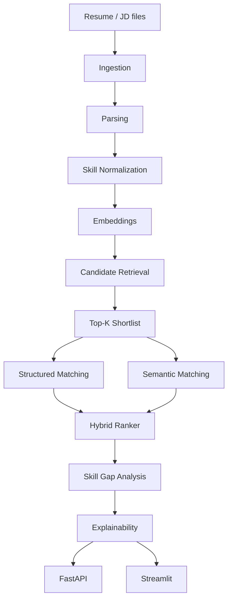

# AI Resume Screening & Explainable AI

## Overview

A modular resume screening pipeline that ingests PDF/DOCX/TXT documents, parses resumes and job descriptions, shortlists candidates with embeddings, ranks them with a hybrid scorer, and produces evidence-grounded explanations. Includes a FastAPI backend and Streamlit demo.

## Problem Statement

Keyword-only and TF-IDF approaches miss semantic equivalence, cannot distinguish required vs preferred skills, and produce opaque scores with little explanation of ranking decisions.

## Solution

A layered pipeline separates **retrieval** (who might be relevant) from **ranking** (how well they match) and adds a presentation-only explainability layer. All screening logic lives in `ScreeningService`; FastAPI and Streamlit are thin presentation layers.

## Key Features

- Document ingestion (PDF, DOCX, TXT) with validation
- Deterministic resume and JD parsing (no invented fields)
- Skill normalization via shared ontology (`configs/skills.yaml`)
- Embedding-based candidate retrieval (top-K shortlist)
- TF-IDF, semantic, and structured skill matching
- Hybrid ranking with configurable, renormalized weights
- Skill-gap analysis and deterministic explanations (optional LLM abstraction)
- FastAPI REST API and Streamlit demo UI
- Controlled evaluation harness (Precision@K, Recall@K, MRR, NDCG@K)

## Architecture



## Matching Pipeline

| Signal | Engine | Role |
|--------|--------|------|
| Retrieval | `InMemoryCandidateRetriever` | Cosine shortlist only |
| TF-IDF | `TfidfBaselineMatcher` | Lexical overlap baseline |
| Semantic | `SemanticMatcher` | Section-aware embedding similarity |
| Structured | `compute_skill_gap()` | Required/preferred skill coverage |
| Experience / Education / Seniority | `HybridRanker` | Rule-based compatibility |
| Final score | `HybridRanker` | Weighted combination (authoritative) |

Retrieval similarity is stored in match metadata for explanations and **never** replaces the hybrid final score.

## Explainability

`ExplanationService` builds summaries, strengths, skill gaps, and interview focus areas from structured match evidence.

- Deterministic explainer always available
- Optional LLM abstraction (`llm.enabled: false` by default)
- Explanations are presentation-only and never modify scores or ranking

## API

| Method | Path | Description |
|--------|------|-------------|
| GET | `/api/health` | Health check |
| POST | `/api/screen` | Screen resumes against a job (multipart form) |

**POST /api/screen** form fields: `job_text` (required), `job_title`, `resumes` (files), `top_k`, `explain`.

Example (PowerShell):

```powershell
curl.exe -s http://127.0.0.1:8000/api/health

curl.exe -s -X POST http://127.0.0.1:8000/api/screen `
  -F "job_text=Looking for a Python ML engineer with PyTorch and SQL" `
  -F "job_title=ML Engineer" `
  -F "explain=true" `
  -F "resumes=@path\to\resume.txt;type=text/plain"
```

Response includes ranked candidates with overall score, component scores, matched/missing skills, and optional explanations. Email and phone are stripped.

## Streamlit Demo

```powershell
.\.venv\Scripts\streamlit.exe run app/streamlit_app.py
```

Paste a job description, upload resumes, click **Screen Candidates**, and review ranked cards with component scores, skill gaps, and explanations.

## Project Structure

```
v2/
├── app/
│   └── streamlit_app.py
├── configs/
│   ├── config.yaml
│   └── skills.yaml
├── docs/
├── scripts/
│   ├── evaluate.py
│   └── evaluate_semantic_vs_tfidf.py
├── src/
│   ├── api/                 # FastAPI app + routes
│   ├── embeddings/
│   ├── evaluation/
│   ├── explainability/
│   ├── extraction/
│   ├── ingestion/
│   ├── llm/                 # Optional LLM abstraction
│   ├── matching/
│   ├── models/
│   ├── parsing/
│   ├── preprocessing/
│   ├── ranking/
│   ├── retrieval/
│   ├── services/            # ScreeningService + document pipeline
│   └── utils/
├── tests/
├── Dockerfile
├── pyproject.toml
└── requirements.txt
```

## Installation

```powershell
cd C:\resume_screening_new\v2
python -m venv .venv
.\.venv\Scripts\activate
pip install -r requirements.txt
```

Use the project virtual environment for all commands below.

## Running the Application

**FastAPI:**

```powershell
.\.venv\Scripts\python.exe -m uvicorn src.api.main:app --reload --port 8000
```

**Streamlit:**

```powershell
.\.venv\Scripts\streamlit.exe run app/streamlit_app.py
```

## Testing

```powershell
.\.venv\Scripts\python.exe -m pytest -q
```

## Evaluation

```powershell
.\.venv\Scripts\python.exe scripts\evaluate.py
```

The included fixture is a small **controlled synthetic demonstration benchmark** — not a statistically significant production benchmark.

## Docker

Docker is configured for this project. The default container entrypoint runs **FastAPI**.

**Build:**

```powershell
docker build -t ai-resume-screening .
```

**Run FastAPI (default):**

```powershell
docker run --rm -p 8000:8000 ai-resume-screening
```

**Health check:**

```powershell
curl.exe http://127.0.0.1:8000/api/health
```

Expected: `{"status":"ok"}`

**Run Streamlit (same image, override command):**

```powershell
docker run --rm -p 8501:8501 ai-resume-screening `
  streamlit run app/streamlit_app.py --server.port=8501 --server.address=0.0.0.0 --server.headless=true
```

Notes:

- The embedding model (`sentence-transformers/all-MiniLM-L6-v2`) may download on first screening request if it is not already available in the container.
- Candidate retrieval is in-memory only — there is no persistent candidate storage across container restarts.
- Local Streamlit without Docker: `.\.venv\Scripts\streamlit.exe run app/streamlit_app.py`

> Docker build/runtime verification could not be executed in the last verification environment because Docker was unavailable. The `Dockerfile` and `.dockerignore` are finalized and ready to build when Docker is installed.

## Limitations

- In-memory retrieval only — candidate vectors held in RAM
- Pre-trained embeddings are not fine-tuned on resume-specific data
- Small controlled evaluation fixture — not a production benchmark
- Text-layer PDFs only (scanned/image PDFs unsupported)
- LLM explanations disabled by default
- Heuristic parsers can miss atypical resume/JD layouts

## Future Improvements

1. Persistent vector store for larger candidate pools
2. Domain-adapted embedding fine-tuning on resume/JD pairs
3. Broader JD template support for diverse hiring formats
4. Labelled evaluation dataset for proper benchmark reporting

## License

Educational / portfolio use. Do not commit personal data (PII) to this repository.
