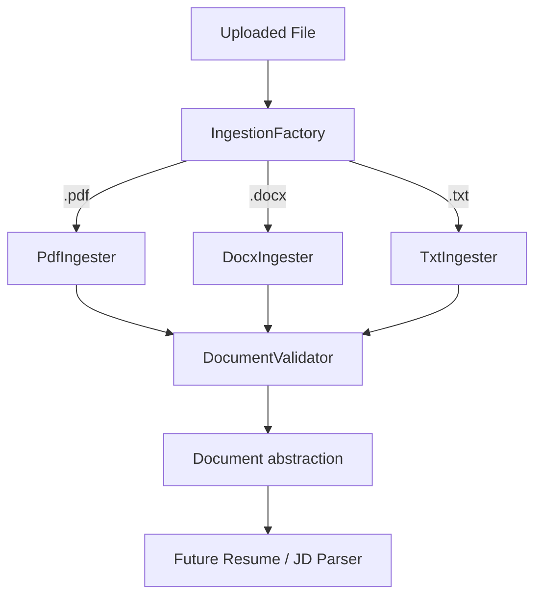
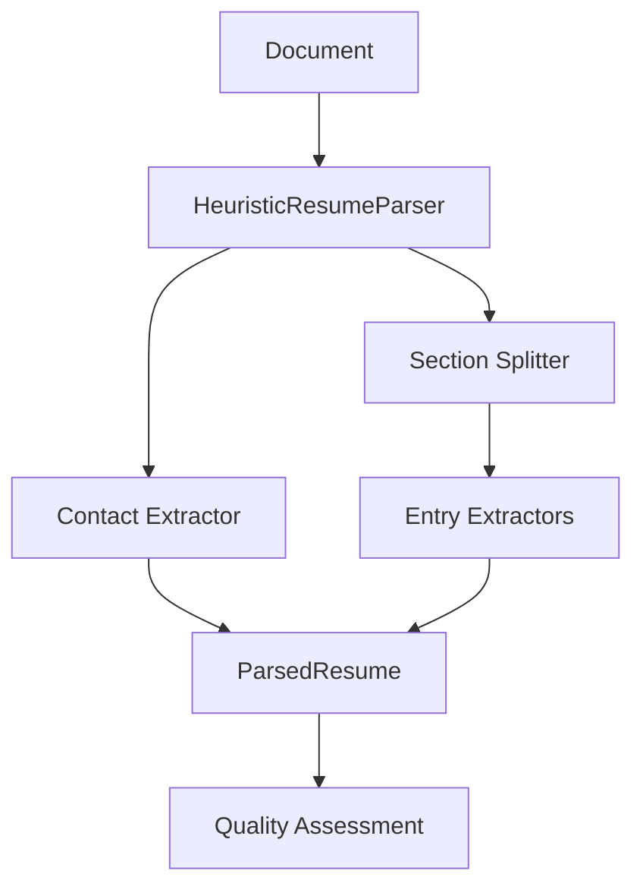
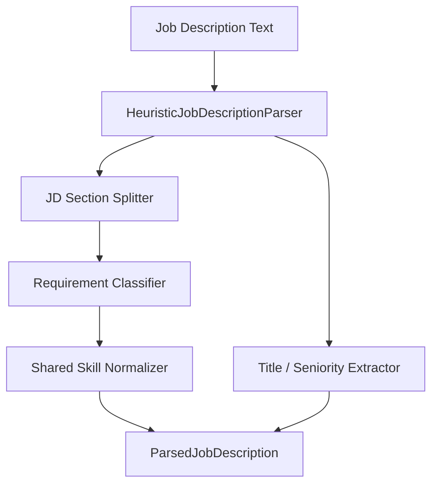
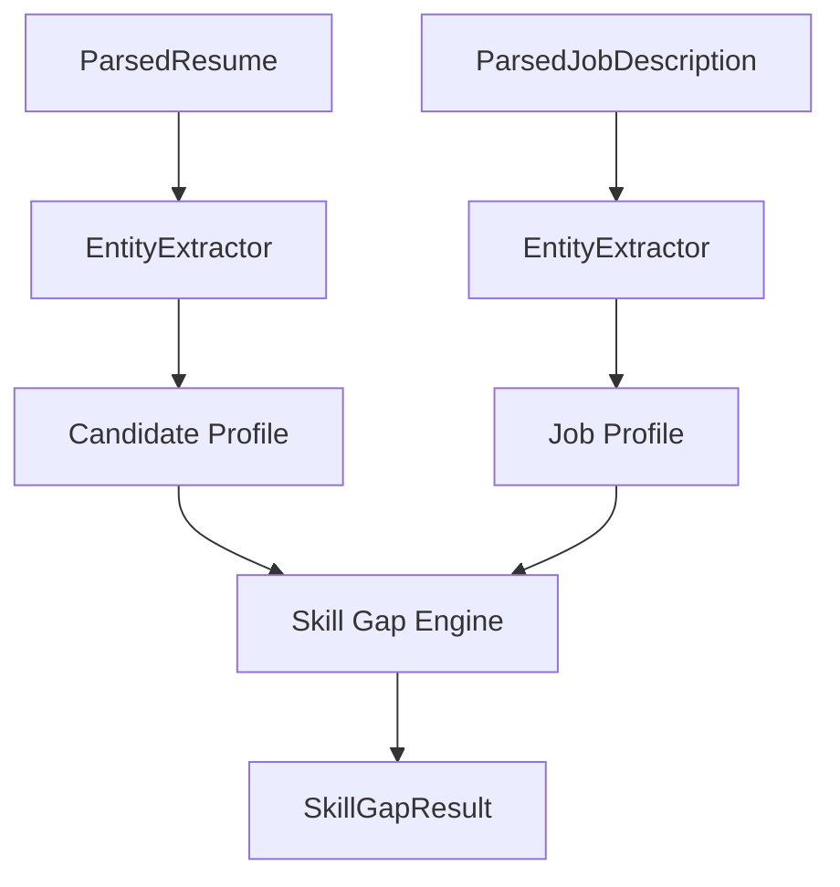
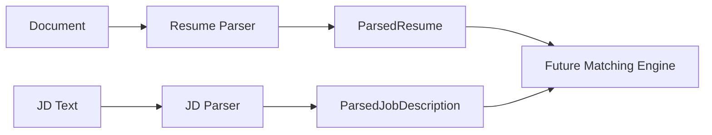
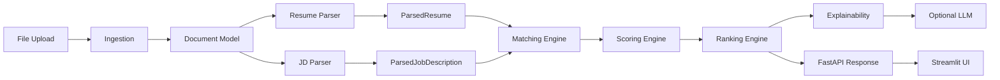

# V2 Architecture

> **Status:** Phase 6 — unified entity intelligence and skill gap. See [entity_intelligence.md](entity_intelligence.md).

## Overview

V2 follows a layered, interface-driven design. Each layer communicates through Pydantic models and abstract base classes, enabling independent testing and phased implementation.

## Document Ingestion (Phase 3)

### Ingestion pipeline

1. **Factory routing** — `IngestionFactory` selects the ingester by file extension.
2. **Pre-validation** — extension, file size, magic bytes, MIME hint (configurable).
3. **Format extraction** — per-page PDF text, DOCX paragraphs/tables, TXT with encoding fallbacks.
4. **Post-validation** — reject empty extracted text when configured.
5. **Document model** — unified `Document` with `document_id`, `raw_text`, pages, metadata, warnings.

### Error taxonomy

| Error | When |
|-------|------|
| `UnsupportedFileTypeError` | Bad extension or magic bytes |
| `FileTooLargeError` | Exceeds `max_upload_size_mb` |
| `CorruptedFileError` | PDF/DOCX parse failure |
| `ExtractionFailureError` | Decode/extraction failure |
| `EmptyDocumentError` | Zero-byte file or empty extracted text |

Raw library exceptions are logged internally; callers receive domain-level errors.

## Resume Parsing (Phase 4)

1. **Section splitting** — detect headings (ALL CAPS, colons, markdown `##`) via configurable keywords.
2. **Contact extraction** — name, email, phone from header block (pre-first-section text).
3. **Entry extraction** — skills, experience, education, projects, certifications from section content.
4. **Quality assessment** — `high` / `medium` / `low` based on detected structure (not statistical confidence).

Pipeline: `ingest_document()` → `HeuristicResumeParser.parse()` → `ParsedResume`

## Job Description Parsing (Phase 5)

See [job_parsing.md](job_parsing.md) for full documentation.

## Entity Intelligence & Skill Gap (Phase 6)

See [entity_intelligence.md](entity_intelligence.md) for full documentation.

## Dual Input Pipeline (Pre-Matching)

## Data Flow (Target State)

## Implemented

- Configuration management (`src/utils/config.py`)
- Pydantic domain models (`src/models/`)
- Abstract interfaces for all major components
- TF-IDF baseline matcher and ranker
- **Document ingestion** — PDF, DOCX, TXT via `IngestionFactory`
- **Resume parsing** — `HeuristicResumeParser` with section/contact/entry extraction
- **JD parsing** — `HeuristicJobDescriptionParser` with required/preferred/**mentioned** skills
- **Entity extraction** — unified `EntityExtractor` + shared skill normalization
- **Skill gap analysis** — deterministic `compute_skill_gap()`
- Unit tests for baseline, preprocessing, config, and ingestion

## Planned Layers

Detailed implementation docs will be added as each phase completes.

| Component | Module | Phase |
|-----------|--------|-------|
| Ingestion | `src/ingestion/` | **3 — done** |
| Resume parsing | `src/parsing/resume_parser.py` | **4 — done** |
| JD parsing | `src/parsing/job_parser.py` | **5 — done** |
| Embeddings | `src/embeddings/` | 7 |
| Hybrid scoring | `src/scoring/` | 8 |
| Explainability | `src/explainability/` | 10 |
| LLM | `src/llm/` | 13 |
| API | `api/` | 14 |
| Frontend | `app/` | 15 |
| Database | `src/storage/` | 16 |

## Design Principles

1. **LLM does not score** — numerical scores come from deterministic engines
2. **Explainability from features** — no fabricated explanations
3. **Fallback architecture** — core matching works without LLM or vector index
4. **Configurable weights** — no magic numbers in business logic
5. **Legacy preserved** — V1 code untouched at repository root
