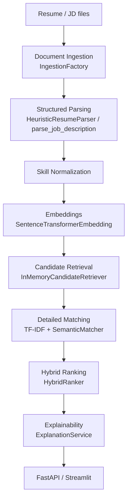

# Architecture

## Overview

The system is a layered pipeline for resume screening. Each layer communicates through Pydantic models and abstract base classes. Retrieval shortlists candidates; hybrid ranking produces authoritative scores; explainability is presentation-only.

## End-to-End Pipeline

## Layer Responsibilities

| Layer | Module | Role |
|-------|--------|------|
| Ingestion | `src/ingestion/` | PDF, DOCX, TXT → `Document` |
| Parsing | `src/parsing/` | Resume/JD section and skill extraction |
| Extraction | `src/extraction/` | Skill normalization, entity profiles |
| Embeddings | `src/embeddings/` | Sentence-transformer encoding + disk cache |
| Retrieval | `src/retrieval/` | Top-K shortlist by vector similarity |
| Matching | `src/matching/` | TF-IDF baseline, semantic similarity, skill gap |
| Ranking | `src/ranking/` | `HybridRanker` — authoritative final score |
| Explainability | `src/explainability/` | Deterministic + optional LLM narrative |
| Services | `src/services/` | `ScreeningService` orchestration |
| API | `src/api/` | FastAPI `/api/health`, `/api/screen` |
| UI | `app/streamlit_app.py` | Streamlit demo |

## Retrieval vs Ranking

**Retrieval** answers: *Which candidates are potentially relevant?*  
It uses cosine similarity over full-document embeddings to produce a top-K shortlist efficiently.

**Ranking** answers: *How well does each candidate match the job?*  
`HybridRanker` combines structured skill coverage, semantic similarity, experience, education, and seniority with configurable weights. Retrieval similarity is attached to match metadata for evidence only — it never overwrites the final score.

## Explainability

`ExplanationService` delegates to `DeterministicExplainer` by default. An optional `LLMExplainer` abstraction exists but is disabled in config. Explanations operate on deep copies and never modify `MatchResult` or ranking scores.

## Configuration

Single source of truth: `configs/config.yaml` (+ `configs/skills.yaml` merged at load time). Loaded via `src/utils/config.py` with optional environment overrides.

## Further Reading

- [retrieval.md](retrieval.md)
- [semantic_matching.md](semantic_matching.md)
- [hybrid_matching.md](hybrid_matching.md)
- [explainability.md](explainability.md)
- [job_parsing.md](job_parsing.md)
- [entity_intelligence.md](entity_intelligence.md)
