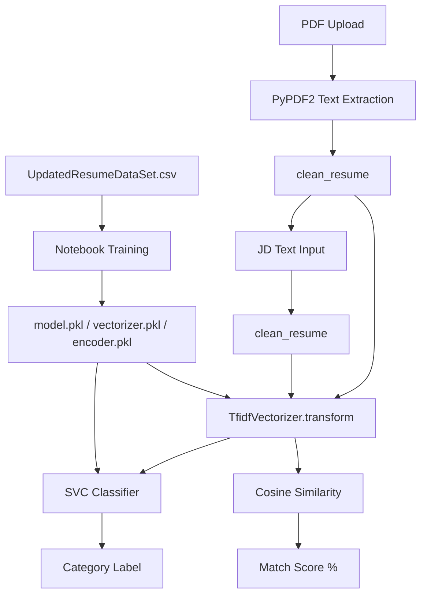
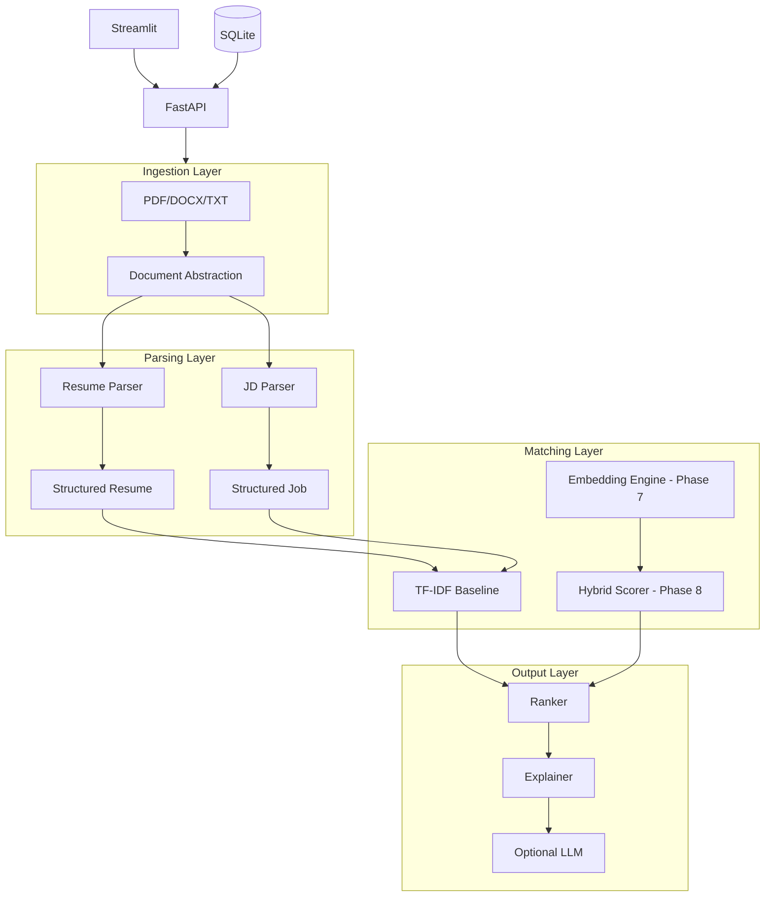

# Phase 1 Audit Report: Existing Resume Screening System

**Date:** 2026-08-13  
**Repository:** AI-Powered-Resume-Screening---Candidate-Ranking-System  
**Scope:** Full audit before V2 implementation. No modifications were made to legacy code.

---

## 1. Repository Inventory

| File | Role |
|------|------|
| `app.py` | Streamlit UI — single-file application |
| `resume_screening.ipynb` | Development notebook — EDA, training, model export, ranking prototype |
| `UpdatedResumeDataSet.csv` | Training dataset (~962 rows) |
| `model.pkl` | Serialized `OneVsRestClassifier(SVC(kernel='linear'))` |
| `vectorizer.pkl` | Serialized `TfidfVectorizer` (2000 features) |
| `encoder.pkl` | Serialized `LabelEncoder` for category labels |
| `requirements.txt` | Python dependencies |
| `README.md` | Project documentation |

No other source directories, tests, API layer, or configuration files exist.

---

## 2. What the Current System Does

### 2.1 Data

- **Schema:** `Category` (string label), `Resume` (raw text)
- **Size:** 962 samples (769 train / 193 test after 80/20 split in notebook)
- **Categories:** 25 job categories (e.g., Data Science, Java Developer, Python Developer, HR, etc.)
- **Content:** Pre-extracted resume text (not raw PDFs). Significant duplicate rows observed in notebook output (rows 0–9 repeat as 10–19).
- **Encoding issues:** Non-ASCII characters appear corrupted in some rows (e.g., bullet symbols).

### 2.2 Text Preprocessing (`clean()`)

Applied in notebook and `app.py` (slightly different variants):

1. Remove URLs (`http...`)
2. Remove `RT`, `cc`, hashtags, mentions
3. Remove punctuation (notebook only)
4. Normalize whitespace
5. Remove non-ASCII characters
6. Lowercase (app.py only; notebook does not lowercase in `clean()`)

### 2.3 Classification Pipeline (Notebook)

1. Load CSV → apply `clean()` → store as `clean text`
2. `TfidfVectorizer(sublinear_tf=True, stop_words='english', max_features=2000)`
3. Fit vectorizer on all 962 documents
4. `LabelEncoder` on `Category`
5. 80/20 `train_test_split` (random_state=0)
6. Classifier: `OneVsRestClassifier(SVC(kernel='linear', probability=True))`
7. Reported test **accuracy: 0.99** (193 test samples)
8. Serialize model, vectorizer, encoder to `.pkl` files

### 2.4 Streamlit Application (`app.py`)

On startup:

- Loads all three pickle artifacts into global scope (no error handling if missing)

On PDF upload:

1. Extract text via `PyPDF2.PdfReader` (all pages concatenated)
2. Clean text with simplified `clean_resume()` (lowercase, no punctuation strip)
3. **Classification:** `vectorizer.transform` → `model.predict` → `encoder.inverse_transform`
4. Display predicted category

On "Analyze Match" button:

1. Clean pasted job description
2. Transform JD and resume with same vectorizer
3. `cosine_similarity(jd_vector, resume_vector)` → single match percentage
4. Display progress bar

### 2.5 Ranking Prototype (Notebook, not in app)

- `rank_resumes(job_description, resume_texts)` function
- Vectorizes JD + all resumes together with trained vectorizer
- Returns cosine similarity scores
- Sorts dataset by score — **not exposed in Streamlit UI**

---

## 3. Architecture Diagram (Current)

**Pattern:** Monolithic — UI, preprocessing, inference, and artifact loading in one file.

---

## 4. Weaknesses and Limitations

### Functional

| Limitation | Impact |
|------------|--------|
| PDF-only ingestion | No DOCX/TXT support |
| No structured parsing | Resume treated as flat text blob |
| No skill extraction | Cannot explain *why* a candidate matches |
| Single-candidate matching in UI | No batch ranking despite notebook prototype |
| Category prediction ≠ job fit | Predicted category may not match pasted JD |
| Same vectorizer for classify + match | Classifier trained on resume corpus; JD matching reuses it without JD-specific tuning |
| No required/preferred skill distinction | All tokens weighted equally in TF-IDF |

### Engineering

| Issue | Detail |
|-------|--------|
| No tests | Zero automated test coverage |
| No API | Streamlit-only; not integratable |
| Global model loading | `app.py` loads pickles at import time |
| No configuration | Hard-coded paths and parameters |
| No logging/observability | Silent failures possible |
| Pickle artifacts | Not versioned, not reproducible from code alone |
| No `.env` / secrets handling | N/A currently (no external APIs) |
| Notebook/model mismatch | Notebook `clean()` differs from `app.py` `clean_resume()` |

### Data Quality

| Issue | Detail |
|-------|--------|
| Duplicate rows | Repeated resume text inflates metrics |
| No ground-truth relevance labels | Dataset has categories, not JD–resume match scores |
| Text-only resumes | No layout/section structure preserved |
| Encoding artifacts | Bullet points and special chars corrupted |

### Responsible AI

| Gap | Detail |
|-----|--------|
| No fairness controls | Name/demographics not explicitly excluded from scoring |
| No explainability | Black-box similarity percentage only |
| Overstated README claims | "Semantic similarity" — actually bag-of-words TF-IDF, not embeddings |

---

## 5. Opportunities for V2

1. **Modular architecture** — separate ingestion, parsing, matching, ranking, API, UI
2. **Structured resume/JD models** — Pydantic schemas for explainable features
3. **Semantic embeddings** — Sentence Transformers alongside TF-IDF baseline
4. **Hybrid scoring** — skills + experience + semantic + education with configurable weights
5. **Explainability** — feature-based explanations, not fabricated LLM text
6. **Evaluation framework** — Precision@K, NDCG with documented limitations
7. **Multi-format ingestion** — PDF, DOCX, TXT with validation
8. **FastAPI + Streamlit separation** — production-style boundaries
9. **Tests and CI** — reproducible quality gates
10. **Optional LLM layer** — summaries only; scores remain deterministic

---

## 6. Proposed V2 Architecture (Phase 2 Foundation)

**Phase 2 deliverables:** Directory structure, config, typed models, abstract interfaces, TF-IDF baseline reimplementation, baseline tests.

---

## 7. Files to Leave Untouched (Legacy)

- `app.py`
- `resume_screening.ipynb`
- `model.pkl`, `vectorizer.pkl`, `encoder.pkl`
- `UpdatedResumeDataSet.csv`
- Root `requirements.txt` (V2 has its own `v2/requirements.txt`)
- Root `README.md` (V2 has its own `v2/README.md`)

---

## 8. Evaluation Strategy (Future Phases)

| Component | Metric | Ground Truth Availability |
|-----------|--------|---------------------------|
| Category classifier | Accuracy, F1 | Available (Category column) — but duplicates inflate scores |
| TF-IDF vs Embedding vs Hybrid | Precision@K, MRR, NDCG@K | **Not available** — no JD–resume relevance labels |
| Skill extraction | Precision/Recall vs manual annotation | Requires annotation effort |
| Ablation study | NDCG@K per component | Requires synthetic or annotated ranking set |

**Honest limitation:** The existing dataset supports category classification evaluation only. Ranking evaluation will require a documented protocol (e.g., category-as-proxy relevance, or manual annotation subset) — metrics will not be fabricated.

---

## 9. Model Candidates (V2 Roadmap)

| Purpose | Candidate | Rationale |
|---------|-----------|-----------|
| Baseline matching | TF-IDF + cosine (Phase 2) | Reproducible comparison to legacy |
| Semantic matching | `sentence-transformers/all-MiniLM-L6-v2` | Lightweight, local, good sentence similarity |
| Optional LLM | OpenAI-compatible API | Natural language summaries only |
| Vector index | FAISS (Phase 25) | Job recommendation at scale |

---

## 10. Major Dependencies (V2 Phase 2)

| Package | Purpose |
|---------|---------|
| `pydantic` | Typed data models |
| `pyyaml` | Configuration |
| `scikit-learn` | TF-IDF baseline |
| `numpy` | Numerical operations |
| `pytest` | Testing |

Additional dependencies (FastAPI, Streamlit, sentence-transformers, etc.) deferred to later phases.
